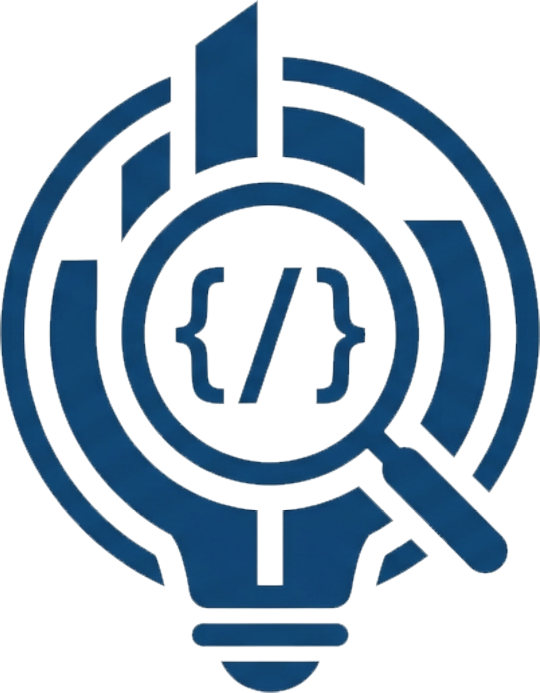

<div align="center">

<div align="center">


# Lumen

### RAG system for querying your own codebase

      

</div>

---

## What is Lumen?

Lumen is a local RAG (Retrieval-Augmented Generation) system that indexes and queries code from your own Git repositories. Point it at any repo, and you can ask natural language questions about the code — it retrieves the most relevant chunks and generates an answer using a local LLM, with exact source references.

No cloud. No API keys. Everything runs on your own machine.

---

## Features

- **Smart chunking** — splits code by function and class using `tree-sitter` (Python and TypeScript), not by arbitrary line count
- **Hybrid search** — combines vector similarity (pgvector HNSW) and full-text search (PostgreSQL `tsvector`) merged via **Reciprocal Rank Fusion**
- **Local LLM** — runs Gemma 2 2B (Q4_K_M GGUF) in-process via `llama-cpp-python`, no Ollama server needed
- **Source citations** — every answer includes the exact retrieved code chunks with file, type and line numbers
- **Re-indexing safe** — indexing the same project again replaces existing chunks, no duplicates
- **Dockerized** — PostgreSQL + pgvector runs in a container, zero manual DB setup

---

## Tech Stack

| Layer | Technology |
|---|---|
| API | FastAPI |
| Database | PostgreSQL + pgvector |
| Embeddings | sentence-transformers · MiniLM-L6-v2 (384-dim) |
| LLM | Gemma 2 2B · Q4_K_M GGUF · llama-cpp-python |
| Code parsing | tree-sitter |
| Repo cloning | GitPython |
| Infrastructure | Docker · Docker Compose |

---

## Architecture

```
POST /index  (project_name, git_url)
│
├── Clone repo → tempdir (GitPython)
├── Walk .py files → chunk by function/class (tree-sitter)
├── Embed each chunk (MiniLM-L6-v2)
├── Store in PostgreSQL: projects → files → chunks
│   ├── chunks.embedding  vector(384)  HNSW index
│   └── chunks.content_tsv  tsvector   GIN index
└── Delete tempdir — only embeddings persist


POST /query  (query, project_name)
│
├── Embed query (MiniLM-L6-v2)
├── Hybrid search scoped to project
│   ├── Vector similarity  (pgvector · cosine · HNSW)
│   ├── Full-text search   (tsvector · GIN · ts_rank)
│   └── Merge rankings     (Reciprocal Rank Fusion)
├── Top chunks → context for Gemma 2 2B
└── Return { answer, sources }
```

---

## Database Schema

```
projects
  └── files (CASCADE)
        └── chunks (CASCADE)
              ├── embedding   vector(384)   — HNSW (cosine)
              └── content_tsv tsvector      — GIN index
```

---

## Getting Started

### Requirements

- Docker & Docker Compose
- Python 3.10+
- `models/gemma-2-2b-it-q4_k_m.gguf` — download from [HuggingFace](https://huggingface.co/google/gemma-2-2b-it-GGUF) and place in the `models/` folder

### Setup

```bash
# 1. Start PostgreSQL + pgvector
docker compose up -d

# 2. Install Python dependencies
pip install -r requirements.txt

# 3. Create tables and indexes
python backend/db/schema.py

# 4. Start the API
uvicorn main:app --reload
```

### Index a repository

```bash
curl -X POST http://localhost:8000/index \
  -H "Content-Type: application/json" \
  -d '{"project_name": "my-project", "git_url": "https://github.com/user/repo"}'
```

### Query your code

```bash
curl -X POST http://localhost:8000/query \
  -H "Content-Type: application/json" \
  -d '{"project_name": "my-project", "query": "How does authentication work?"}'
```

---

## Deployment

Tested on a VPS with 4 vCores · 4 GB RAM · 120 GB NVMe. Gemma 2 2B Q4 runs comfortably within that spec.

---

## Roadmap

- [ ] Watchdog — automatic re-indexing on file change
- [ ] Support for additional languages (JavaScript, Go...)
- [ ] Skip unchanged files on re-index using `files.file_hash`
- [ ] List and delete indexed projects via API
- [ ] Multi-repo queries

---

## License

MIT